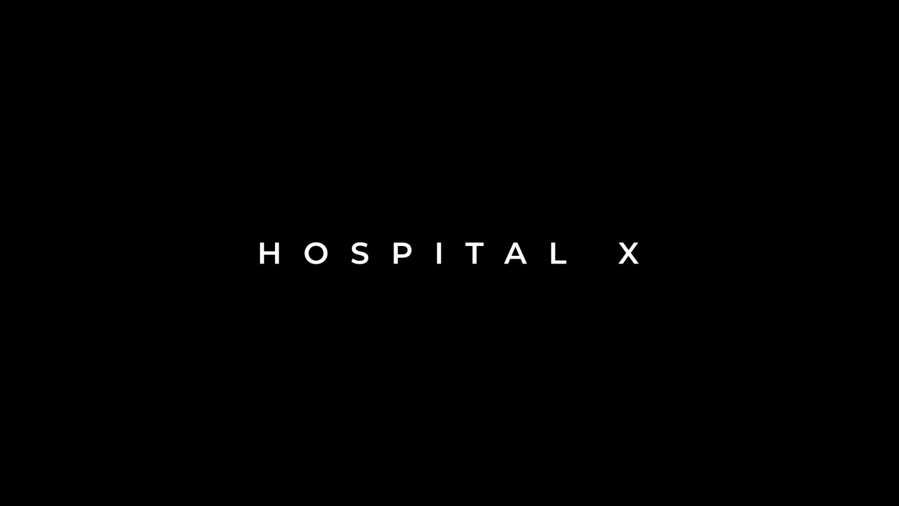

# HospitalX

> **Care flows further.**

What happens when a patient’s story has to travel farther than the patient does?

HospitalX is an offline-conscious hospital operations experience designed to keep patient context, team ownership, and the next action connected—from arrival to continuity of care. It is our answer to a very human problem: good people can still lose the thread when the work is spread across queues, handoffs, and systems that do not talk to each other.

[](public/interfrozt/media/hospitalx-evolved.mp4)

> **Section 04 — Connected modules.** Select the film above to watch the HospitalX product story with sound.

## Why HospitalX

Imagine the moment before a handoff. The patient has moved, the shift has changed, the network has had a bad day, and everyone is trying to answer the same question: **what happens next?**

Hospital work rarely fails because a team does not care. It fails when a patient story gets fragmented between queues, handoffs, systems, and moments of unreliable connectivity. No one should need a scavenger hunt across six screens to understand one person’s care.

HospitalX turns that scattered journey into one calmer operational view:

- **One patient context** shared by front desk, clinical teams, diagnostics, pharmacy, billing, and operations.
- **Clear ownership** so every handoff has a visible next team and next action.
- **Offline-aware continuity** so the interface remains useful when connectivity is not.
- **Calm command surfaces** that surface what needs attention without becoming another noisy dashboard.

## V1 at a glance

Think of V1 as the opening shift: the story, the work surfaces, and the foundations are here. The clinical pilot controls still have to earn their place.

| Surface | What it delivers |
| --- | --- |
| Landing experience | Cinematic, accessible HospitalX product story with intentional loading, performance-conscious cursor treatment, and an ambient soundtrack control. |
| Command Center | A responsive operational overview for live patient, appointment, bed, and task signals. |
| Care workflows | Patient registration, appointments, beds, orders, inventory, billing, referrals, screening, and role-oriented workspaces. |
| Madhu guide | An optional on-page care co-pilot experience that helps visitors understand HospitalX. |
| Resilience | Service worker registration, offline queue foundations, and guarded automatic recovery for stale client assets. |
| Desktop and mobile foundations | Capacitor Android and Tauri desktop build pathways alongside the web application. |

## Product principles

1. **Context before clicks.** A person should not have to reconstruct a patient story from disconnected screens.
2. **The next action must be obvious.** Work moves forward only when ownership and status are legible.
3. **Calm is a safety feature.** Visual hierarchy should reduce cognitive load, especially in operational environments.
4. **Connectivity is not guaranteed.** Local queues, freshness, and recovery are product responsibilities.
5. **Humans stay accountable.** AI can assist with navigation, summaries, and preparation; it must not diagnose, prescribe, or silently complete clinically material work.

The simple question behind every principle is: **would this make the next person’s job clearer—or just give them another place to click?**

## Benefits

The goal is not “more software.” It is fewer moments where a capable person has to pause and ask, *“Where did the context go?”*

| For | Benefit | What changes in practice |
| --- | --- | --- |
| Clinical teams | Less time reconstructing the story | The patient’s context, outstanding work, and next owner remain visible across handoffs. |
| Operations teams | A calmer operational picture | Capacity, tasks, teams, and exceptions can be read from one coordinated surface. |
| Patients and families | More continuity across moments of care | Teams work from the same evolving context instead of disconnected updates. |
| Hospital leadership | A foundation for resilient workflows | Offline-aware patterns and auditable workflow boundaries support a safer path to scale. |

## How to use HospitalX

Start with the care journey, not a menu. When work is connected, the flow is pleasantly boring: see the context, take the next action, leave a clear trail for the next person.

A typical workflow is:

1. **Open Command Center** to orient around live activity, capacity, and work needing attention.
2. **Find or register the patient** and confirm the essential context before beginning a new action.
3. **Move through the care flow**—arrival, assessment, diagnosis, treatment, and continuity—while assigning a clear owner and next step at each handoff.
4. **Use the relevant module** for appointments, beds, orders, inventory, billing, referrals, or screening; return to the patient context to keep work connected.
5. **Review exceptions and offline state** before closing a task. If the context is unclear, do not guess—make the gap visible and resolve it with the responsible team.

Want the longer version? Start with [core workflows](ZRO/05-workflows.md), then use the [developer guide](Docs/README.md) to run the project locally.

## Architecture

HospitalX is structured as a Next.js application with a modular operational core:

```text
Experience       Landing, Command Center, role workspaces, mobile and desktop shells
Application      Commands, queries, validation, workflow orchestration, API routes
Domain           Patients, appointments, beds, orders, billing, inventory, referrals
Data             PostgreSQL / Neon, Drizzle schema and migrations, offline queue support
Foundation       Clerk-ready identity, audit surfaces, service worker, recovery, observability hooks
```

The intended production direction is a modular monolith backed by a relational transactional store, event/outbox patterns, audited mutations, and durable projections. Read the [architecture](ZRO/03-architecture.md) and [current implementation status](ZRO/10-current-implementation.md) before treating a prototype capability as a production guarantee.

## Quick start

### Prerequisites

- Node.js 20 or later
- npm 10 or later
- Optional: a Neon/Postgres database for persistence
- Optional: Clerk keys for hosted authentication

### Run locally

```bash
npm install
npm run dev
```

Open [http://localhost:3000](http://localhost:3000).

The landing experience can run without database credentials. Server-backed workflows require a database URL.

### Environment

Create `.env.local` when connecting external services:

```bash
DATABASE_URL="postgresql://…"
NEXT_PUBLIC_CLERK_PUBLISHABLE_KEY="pk_…" # optional
CLERK_SECRET_KEY="sk_…"                 # optional
NEXT_PUBLIC_SITE_URL="https://your-domain.example"
```

Never commit `.env.local` or production credentials.

### Validate

```bash
npm test
npm run build
```

## Delivery targets

| Target | Command | Notes |
| --- | --- | --- |
| Web | `npm run build` | Next.js standalone output for deployment. |
| Android | `npm run build:android` | Synchronizes Capacitor Android and builds the configured artifact. |
| Desktop | `npm run build:desktop` | Uses the Tauri desktop configuration. |
| Windows installer | `npm run build:setup` | Requires the local installer toolchain; release binaries are distributed separately. |

## Documentation

The [Zero-to-Release documentation](ZRO/README.md) is the source of truth for product intent, engineering boundaries, and implementation readiness.

| Read this | When you need |
| --- | --- |
| [Product vision](ZRO/01-product-vision.md) | The problem, users, and product thesis. |
| [Scope and roadmap](ZRO/02-scope-and-roadmap.md) | What V1 includes and what comes next. |
| [Architecture](ZRO/03-architecture.md) | System boundaries and offline strategy. |
| [Workflows](ZRO/05-workflows.md) | The core patient and operational journeys. |
| [Security and compliance](ZRO/06-security-compliance.md) | Required safety, privacy, and authorization posture. |
| [Current implementation](ZRO/10-current-implementation.md) | What is present now and what blocks a clinical pilot. |
| [Developer guide](Docs/README.md) | Local setup, project map, and release-quality checks. |

## Before real-world use

HospitalX V1 is a product prototype and engineering foundation. It is **not a clinical decision system**, a certified medical device, or production-ready clinical software. The honest version is important: polished screens are not a substitute for authorization, audit trails, privacy controls, validation, compliance, and operational approval. Do not use it for diagnosis, treatment, prescribing, emergency triage, or real patient care until those controls are implemented, tested, and approved.

## Team and links

- Product and engineering: **Veyminore**
- Project: **HospitalX**
- Source: [Z-A-R-R-O/HospitalX](https://github.com/Z-A-R-R-O/HospitalX)
- Contact: [Arunezzarro@gmail.com](mailto:Arunezzarro@gmail.com)
- Support: [support.veyminore@gmail.com](mailto:support.veyminore@gmail.com)
- LinkedIn: [Arunez Zarro](https://www.linkedin.com/in/arunezzarro?utm_source=share_via&utm_content=profile&utm_medium=member_android)

© 2026 HospitalX — Veyminore. Built by Team Agitated Fyneshyt. All rights reserved.
